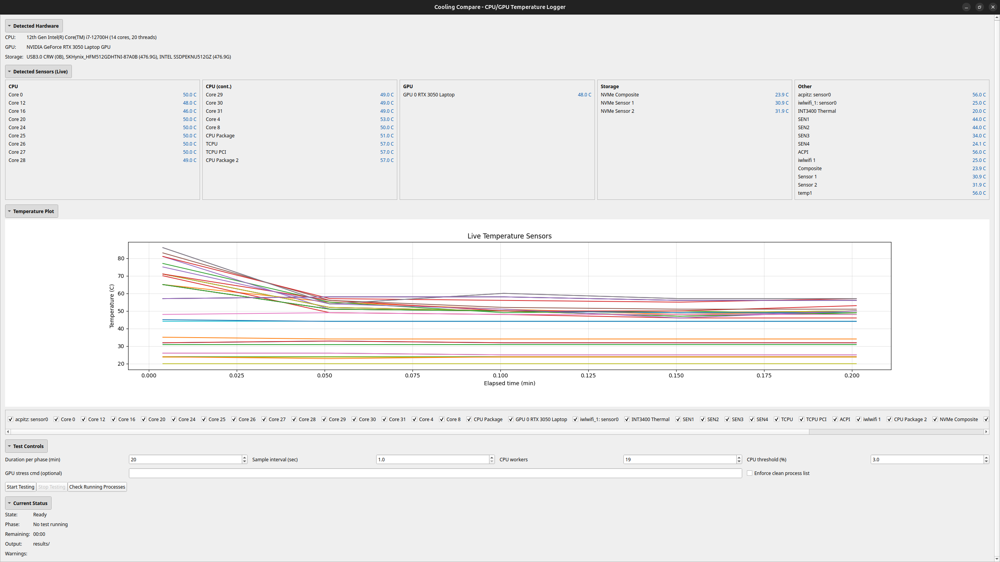

# CoolVerdict

CoolVerdict benchmarks external laptop/PC coolers by comparing temperatures and performance before and after attachment. It automatically detects all available sensors (CPU, GPU, storage), validates readings, deduplicates identical sensors, and provides a data-driven KEEP/RETURN verdict.

**Linux-only** (tested on Ubuntu 24.04). Supports NVIDIA, AMD, and Intel GPUs.



## What It Does

**Four-phase comparison:**
1. Uncooled (idle)
2. Uncooled (stress)  
	- Steady-state check (runs after test 2, before cooled phases)
3. Cooled (idle)
4. Cooled (stress)

**Features:**
- Auto-detects CPU, GPU (NVIDIA/AMD/Intel), and storage temperatures
- Validates all sensor readings (filters invalid data)
- Detects and deduplicates identical sensors across phases
- Steady-state wait inserted after uncooled stress (test 2) before cooler-on phases
- Mild GPU stress testing (auto-generated commands per GPU vendor)
- Live chart, sensor monitoring, and final verdict (KEEP/DEFINITELY KEEP/RETURN/INCONCLUSIVE)
- Live plotting mode switch: raw temperatures <-> rolling-average temperatures (while running)
- Rolling overtime phase comparison with spike suppression (rolling means)
- Enforces clean system state checks for interference-free benchmarking
- Comprehensive reporting: verdict reason, temperature drops, frequency gains, per-sensor analysis

## Setup & Installation

**1. Install system dependencies:**

```bash
# Core temperature sensors
sudo apt install lm-sensors

# GPU support (optional but recommended)
sudo apt install nvidia-utils        # NVIDIA GPUs
# AMD ROCm (if you have AMD GPU): https://rocmdocs.amd.com/
# Intel GPU drivers usually pre-installed on Ubuntu

# Storage sensors
sudo apt install nvme-cli            # NVMe/SSD temps
```

**2. Create Python environment and install:**

```bash
python3 -m venv .venv
source .venv/bin/activate
pip install -r requirements.txt
```

**3. Run the tool:**

```bash
python cooler_verdict.py              # Auto GUI or CLI (based on display)
python cooler_verdict.py --cli        # Force CLI mode
python cooler_verdict.py --help       # Show all options
```

## How It Works

1. **Detection:** On startup, scans for all available temperature sensors (CPU, GPU, storage) and CPU frequency
2. **Validation:** Rejects invalid readings (NaN, out-of-range values) at detection and CSV parsing
3. **Deduplication:** Identifies identical sensors across phases and consolidates them before verdict calculation
4. **GPU Stress:** Auto-generates appropriate mild GPU stress commands (NVIDIA/AMD/Intel)
5. **Phases:** Logs temperature and frequency data during 4 phases (idle/stress × cooled/uncooled)
6. **Steady-state gate:** Waits for temperatures to stabilize after phase 2 before starting cooled phases
7. **Rolling overtime analysis:** Compares uncooled vs cooled trajectories using rolling averages to suppress transient spikes
8. **Verdict:** Uses phase tail-window averages plus rolling overtime metrics to apply multi-criterion decision logic

## Output & Testing

**Output:** Results saved to `results/` as:
- `temperature_log_*.csv` — All temperature/frequency readings per sensor per phase
- `run_metadata_*.json` — Experiment settings, GPU info, phase summaries, rolling overtime comparisons, and full verdict details

**Tests:** Comprehensive test suite with 51 tests covering:
- GPU detection (NVIDIA, AMD, Intel) and capability checking (28 tests)
- Temperature/frequency validation and filtering (4 tests)
- Duplicate sensor detection and deduplication (6 tests)
- Sensor detection, steady-state logic, and rolling overtime comparison (13 tests)

```bash
pytest tests -v
```

## Verdict Criteria

| Criterion | Status | Effect |
| --- | --- | --- |
| **Data Quality** | All 4 phases complete, comparable CPU/GPU sensors, min samples | **INCONCLUSIVE** if fail |
| **Idle Improvement** | Idle best CPU/GPU drop ≥ 3°C | **Required for KEEP** |
| **Idle Penalty** | No idle CPU/GPU worse than -2°C | **RETURN** if fail |
| **Stress Improvement** | Stress best CPU/GPU drop ≥ 3°C | Primary keep pathway |
| **Stress Tradeoff** | Stress +3°C hotter only with ≥3% clock gain | Alternative keep pathway |
| **Stress Penalty** | No stress worse than -3°C without ≥3% gain | **RETURN** if fail |
| **Definitely Keep** | Keep + stress drop ≥5°C (very strong ≥8°C) | Upgrades to **DEFINITELY KEEP** |

**Verdicts:**
- **DEFINITELY KEEP** — Strong cooling benefit with no penalties
- **KEEP** — Clear improvement without downsides
- **PROBABLY RETURN** — Marginal improvements in idle/stress
- **RETURN** — No improvement, penalties, or failed criteria
- **INCONCLUSIVE** — Insufficient data or missing phases

## License

Free to use under the MIT License. See LICENSE.